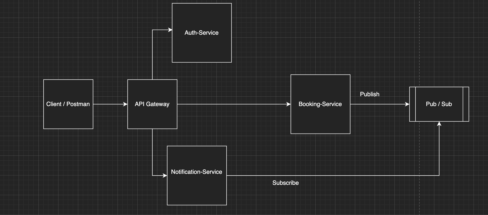

# Welcome to my appointment booking service microservice

A robust backend microservice designed to handle high concurrency appointment bookings. It features atomic locking to prevent double booking, inventory (slot) management, and a clean Repository Service Controller architecture.

# 🛠️ Project Setup

1. Clone the project to your local machine.
2. Install Dependencies: Execute the following command in the root directory:

```
npm install
```

3. Environment Configuration: Create a .env file in the root directory and add the following variables:

```
PORT=3002
MONGODB_URI=<YOUR_MONGODB_CONNECTION_STRING>
```

4. Start the Server:

```
npm start
```

# 🗄️ DB Design & Schema

This project uses MongoDB with Mongoose ODM.

### Entities

- Service (e.g., Doctor, Salon, Cinema Hall)

- Slot (Time inventory for a service)

- Appointment (The actual booking ticket)

### Relationships

- A Service has many Slots, but a Slot belongs to one Service.

- An Appointment belongs to one User, one Service, and one Slot.

- One-to-One (Constraint): One Slot can only have one active Appointment at a time (handled via Atomic Locking).

### Models

1. Service

- name: String

- description: String

- address: String

- price: Number

2. Slot

- serviceId: ObjectId (Ref: Service)

- date: Date

- startTime: String

- endTime: String

- status: Enum (AVAILABLE, BOOKED, LOCKED)

3. Appointment

- userId: String

- serviceId: ObjectId (Ref: Service)

- slotId: ObjectId (Ref: Slot)

- status: Enum (BOOKED, CANCELLED)

# 🚀 API Endpoints

```
Method,Endpoint,Description
POST,/api/v1/appointments/book,Book a slot (Atomic operation).
PATCH,/api/v1/appointments/:id/cancel,Cancel an appointment & free the slot.
GET,/api/v1/appointments?userId=...,Get booking history (Populated data).
POST,/api/v1/services,Create a new Service provider.
POST,/api/v1/slots,Generate slots for a service.
```

# ✨ Features

- Atomic Locking (Concurrency Safety): Prevents "Double Booking" race conditions using MongoDB findOneAndUpdate atomic operators.
- Inventory Management: Slots automatically switch between AVAILABLE and BOOKED statuses.
- Cancellation Logic: Restores slot availability immediately upon cancellation.
- User History: Populated queries to fetch full Doctor/Time details instead of just IDs.

# Tech Stack

- Node.js

- Express.js

- MongoDB (Database)

- Mongoose (ODM)

- JavaScript (ES6 Modules)

# 📚 What I Learned

- Microservice Architecture: Designing a standalone service focused on a single business domain (Booking).

- Handling Race Conditions: How to use Optimistic Locking/Atomic Operations to ensure data integrity when multiple users click "Book" simultaneously.

- Repository Pattern: Decoupling business logic (Service Layer) from database queries (Repository Layer).

- Complex Mongoose Queries: Using .populate() to join multiple collections efficiently for the user dashboard.

# Architecture


